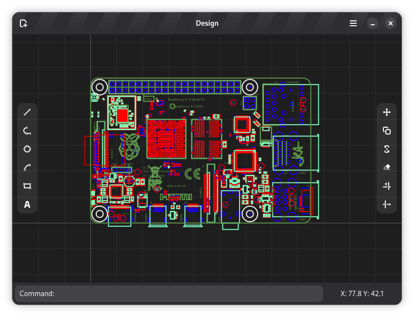
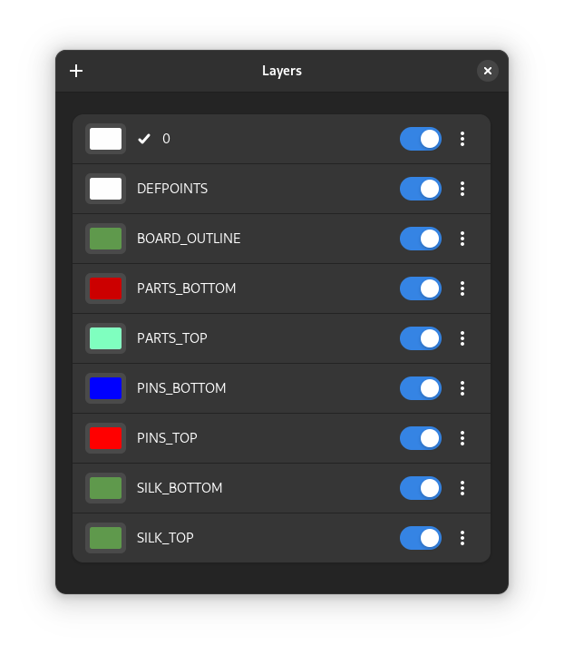
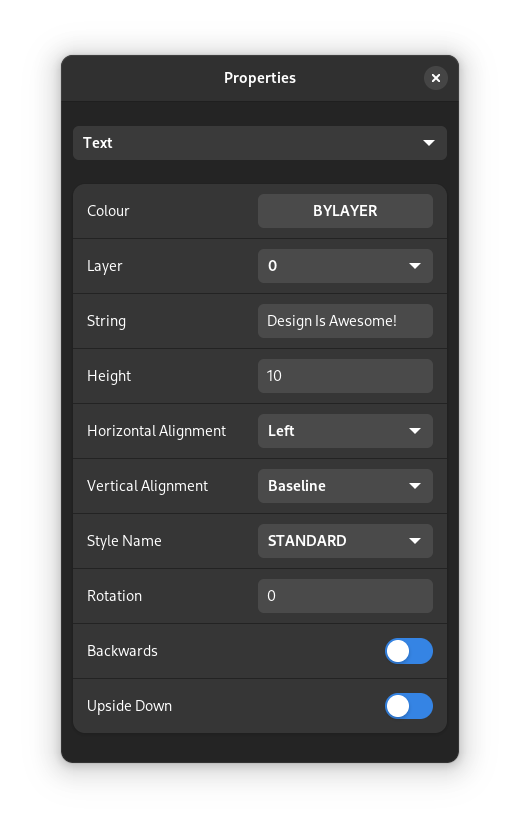

# Design 

2D CAD for GNOME 
&emsp;
___
Design is a 2D computer aided design application (CAD), created to meet the needs of makers and designers, 
hobbyists and professionals that require a first-class CAD application.

___

### History
Design was originally conceived as an [Ubuntu / Ubuntu Phone application](https://launchpad.net/design-app), written in C++, QML and JS. 
When the Ubuntu Phone project was cancelled in 2017 it seemed that would be the end of the road for Design, however the creator 
wondered if Design could possibly live on as a [web app](https://github.com/dubstar-04/Design-Web).

Now in the early 2020s Linux phones are gaining popularity and momentum, the team have reinvented Design as a GNOME application
along with the original aim to provide a native CAD experience whether on the move with a mobile device, pocket PC or at a traditional workstation.
___

### Documentation is available at:
https://design-app.readthedocs.io/en/latest/index.html
___

### Raspberry PI Schematics available from:
https://www.raspberrypi.org/documentation/hardware/raspberrypi/mechanical/README.md
___

### Build Instructions:
Using [GNOME Builder](https://wiki.gnome.org/Apps/Builder) with [flatpak](https://flatpak.org/) is the recommended way of building and installing Design.
___

### Screenshots:

## Contribute

Congratulations! You’re up and running. Now you can begin coding in Design and contribute your fixes and new features to the project. For details on submitting your code to the project, read [Contributing Code](https://github.com/dubstar-04/Design/blob/main/Contributing.md).
